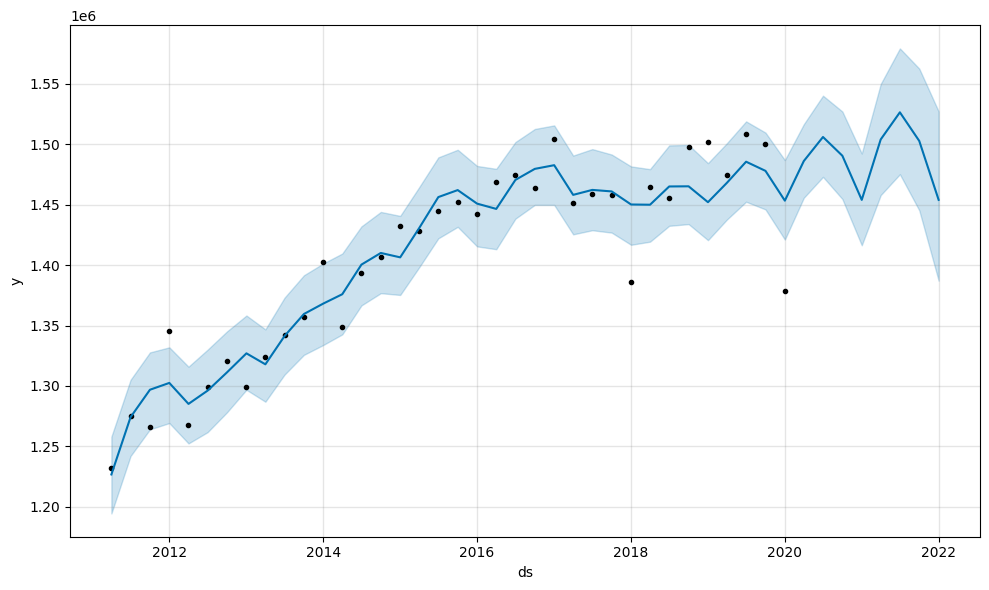
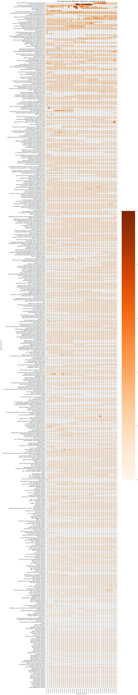
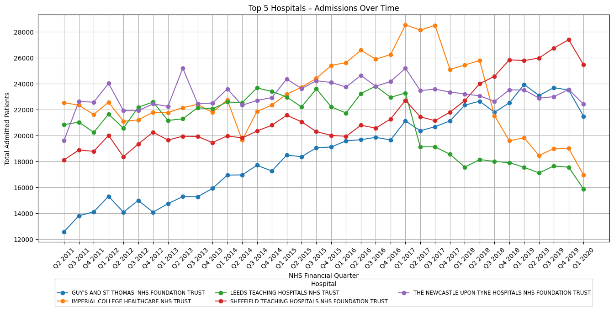

# 🏥 NHS Outpatient Analysis (2011–2020)

This project explores NHS outpatient appointment data from 2011 to 2020. It includes a thorough exploratory data analysis (EDA), forecasting using Prophet and XGBoost, visual summaries of trends, and a Power BI dashboard.

---

## 📦 Dataset

- **Source**: NHS England Outpatient Appointments (2011–2020)
- **Contains**: Hospital names, quarters, appointment volumes, DNA (Did Not Attend) counts, GP referrals, and more.

Jupyter Notebook - 'Output/nhs-admission-data-2011-2020.ipynb'

## 📋 Project Overview

| Stage | Description |
|-------|-------------|
| 🧹 Data Cleaning | Removed England summary row, cleaned nulls, extracted year/quarter columns |
| 🔍 EDA | Null checks, relationship matrix, quarterly trends |
| ⏳ Forecasting | Time series modeling using Prophet and XGBoost |
| 🏥 Hospital Trends | Identified top 5 hospitals by total admissions |
| 🔥 Heatmaps | Visualized trends in admissions, DNA rate, and GP referral rate across hospitals and time |
| 📊 Power BI | Interactive dashboard version of trends, hospital comparisons, and referral behaviors |

---

## 🧠 Key Insights

- DNA (Did Not Attend) rates vary drastically across regions and time.
- GP referral rates correlate with hospital admission volumes.
- Forecasts for 2021–2023 show expected post-COVID rebounds in outpatient activity.

---

## 📈 KEY Visual Outputs

### Admissions Trend Over Time

### Prophet Forcast 

### DNA Rate Heatmap

### Top 5 Hopsitals by Admissions

### GP Referral Rate Heatmap

> All plots saved in the `figures/` directory.

---

## 📊 Power BI Dashboard

The project also includes a fully interactive Power BI dashboard, exported as `.pbix` and screenshot.

### Overview

### Filtered by Year 

### Selected Hopstial 

### File

'PowerBI%20Dashboard/NHS%20Admissions%20Dashboard.pbix'

## 🛠️ Tools Used

- Python (Pandas, Matplotlib, Seaborn, Prophet, XGBoost)
- Power BI (Data model, line charts, KPIs, matrix heatmaps)
- Git & GitHub for versioning

---

## 🔗 Acknowledgements

- NHS England for providing the data
- Kaggle and Power BI for the tooling
- Open-source Python community for analysis libraries

---

## 🚀 Next Steps

- Include monthly-level data if available
- Develop hospital-level forecasting models
- Deploy interactive dashboard online (e.g. Streamlit)

---

*Made by Tom Farnell — 2025*
